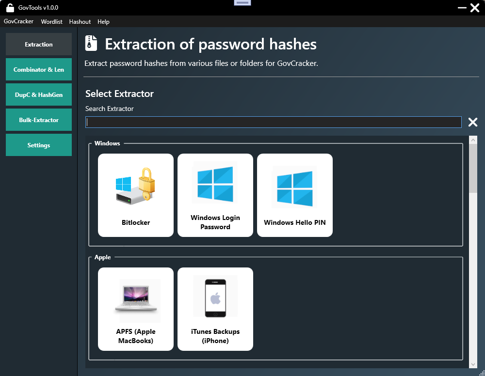
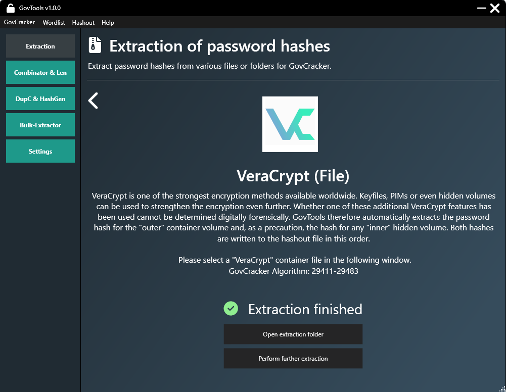

GovTools is an innovative open-source toolkit for Windows, designed to streamline the **extraction of password hashes** from a variety of targets. It acts as **helping hand** for **[GovCracker](https://govcracker.com)**, our **decryption software**. Both tools have been designed to support law enforcement agencies, universities, IT forensic based organizations and lawyers.

Visit **[GovTools' documentation](https://govcracker.com)** to learn more.

## Screenshots

## Supported "Extractors"
GovTools currently supports the extraction of hashes from the following (30, with deviations) targets - more to come:

### Windows
- Bitlocker
- Windows Login Password
- Windows Hello PIN

### Apple
- APFS (Apple MacBook)
- iTunes Backup (iPhone)

### Linux
- eCryptfs
- LUKS Encryption
- Linux Login Password

### Cryptocurrency Wallets
- Bitcoin
- Dogecoin
- Litecoin
- Electrum
- MyEtherWallet
- Exodus
- MultiBit
- MetaMask

### Documents
- PDF
- Office Files (Word, Excel, ...)
- OpenOffice
- LibreOffice

### Other Encryption
- VeraCrypt
- TrueCrypt
- KeePass
- 7zip
- ZIP
- RAR
- Mozilla Firefox

## Learn more
To learn more about **[GovTools](https://govcracker.com/govtools)**, **[GovCracker](https://govcracker.com)** and our other software, click on the corresponding links.

## License: GPLv3
[LICENSE](LICENSE.txt)